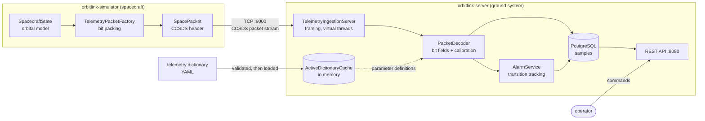

# OrbitLink

A satellite telemetry and command service in Java. A simulated spacecraft
generates CCSDS space packets and downlinks them over TCP; the ground system
decodes them against a versioned telemetry dictionary, applies calibrations,
stores the samples, raises limit alarms, and validates uplink commands.

Built as a portfolio project to work through the problems a real ground system
has to solve: bit-level packet decoding, configuration-controlled dictionaries,
alarm state management, and command validation.

## Architecture



Two Maven modules. **`orbitlink-simulator`** stands in for flight software;
**`orbitlink-server`** is the ground system. They share no code — see the
design decisions below for why that is deliberate.

## Tech

Java 21 · Spring Boot 3 · Spring Data JPA · PostgreSQL · Flyway · Maven ·
JUnit 5 · AssertJ · Testcontainers · JaCoCo · Docker Compose · GitHub Actions

## Quickstart

Requires JDK 21, Maven, and Docker.

```bash
# 1. Start PostgreSQL
docker compose -f deploy/docker-compose.yml up -d

# 2. Start the ground system (HTTP :8080, telemetry TCP :9000)
mvn -pl orbitlink-server spring-boot:run

# 3. In another terminal, start the spacecraft
mvn -pl orbitlink-simulator exec:java \
    -Dexec.mainClass=com.orbitlink.simulator.SimulatorMain \
    -Dexec.args="--rate 2 --fault-rate 0.05"
```

Then:

```bash
curl localhost:8080/api/v1/telemetry/status     # packets received, active dictionary
curl localhost:8080/api/v1/telemetry/latest     # current value of every parameter
curl localhost:8080/api/v1/alarms               # active limit violations
curl localhost:8080/api/v1/commands             # what the spacecraft accepts
```

On first start the server loads `sample-dictionary.yaml`, validates it, and
makes it the active dictionary.

### Simulator options

| Flag | Default | Meaning |
|---|---|---|
| `--host` / `--port` | `127.0.0.1:9000` | ground system address |
| `--rate` | `2.0` | telemetry cycles per second |
| `--fault-rate` | `0.02` | probability of injecting an out-of-limit value per cycle |
| `--packets` | `0` | stop after N packets; 0 runs until interrupted |
| `--seed` | — | fixed RNG seed for a reproducible run |
| `--dry-run` | off | encode and log without connecting |

## The telemetry dictionary

One YAML file describes everything the spacecraft can downlink and every
command it accepts, versioned as a unit:

```yaml
version: "1.0.0"
parameters:
  - mnemonic: BATT_BUS_V
    name: Battery bus voltage
    apid: 100              # which CCSDS packet carries it
    dataType: UNSIGNED_INT
    bitOffset: 0           # from the start of the packet DATA field
    bitLength: 16
    units: V
    calScale: 0.001        # engineering = raw * scale + offset
    minValue: 22.0         # critical low      } red
    maxValue: 34.0         # critical high     }
    warnLow: 24.0          # warning low       } yellow
    warnHigh: 32.0         # warning high      }
commands:
  - mnemonic: SET_TLM_RATE
    apid: 200
    functionCode: 3
    arguments:
      - name: hz
        dataType: FLOAT
        minValue: 0.1
        maxValue: 20.0
```

Validate a candidate file without loading it:

```bash
curl -X POST localhost:8080/api/v1/dictionaries/validate \
     -H 'Content-Type: text/plain' --data-binary @my-dictionary.yaml
```

## Design decisions

### The simulator and the server share no code

`BitWriter` in the simulator and `BitReader` in the server are separate
implementations of the same bit-packing convention, and
`TelemetryPacketFactory` restates the dictionary's offsets rather than reading
the YAML.

This looks like duplication and is deliberate. The simulator stands in for
flight software, and flight software does not import the ground system's
classes — on a real programme both sides implement a published interface
control document and are kept in step by process. Sharing a class would also
let a bug cancel itself out: the encoder and decoder would agree with each
other while both disagreed with the spec.

The cost is real — a change on one side silently breaks the other. What
catches it is `PacketDecoderTest.decodesAPacketBuiltExactlyAsTheSimulatorBuildsIt`,
which builds bytes the simulator's way and asserts the server recovers the
original values.

### Dictionary versions are immutable, and exactly one is active

Telemetry recorded months ago must still decode under the rules that were
active when it arrived, so loading a dictionary never edits an existing
version — it inserts a new one. Re-loading an existing version is rejected
rather than silently overwriting decode rules that stored samples depend on.

"Exactly one active" is a **partial unique index**
(`UNIQUE (active) WHERE active`), not an application check, so two concurrent
activations cannot both succeed.

### Validation runs before anything is persisted

The dictionary validator operates on the parsed YAML records, never on JPA
entities. That ordering is what lets the database carry real constraints: by
the time rows are inserted they are already known good, and a caller can still
dry-run a candidate file and get a full report with no side effects.

Findings are split into ERROR (blocks loading — a duplicate mnemonic makes
telemetry ambiguous) and WARNING (advisory — an unrecognised unit might be a
typo, or might be a real instrument-specific unit). Every problem is reported
in one pass rather than failing on the first, for the same reason a compiler
does not stop at the first syntax error.

### CCSDS packet data length is octet count minus one

The classic place to get CCSDS wrong. The field exists because a packet may
never have an empty data field, so the encoding would otherwise waste its zero
value — a 10-octet payload goes on the wire as `9`.

That field is also what makes the stream self-framing. TCP has no message
boundaries, so ingestion reads exactly 6 octets, learns the payload length,
and reads exactly that many. `readFully` is what makes this correct; a plain
`read()` can return short and would desynchronise the stream permanently. A
rejected packet still has its payload consumed, for the same reason.

### Alarms track transitions, not samples

A parameter sitting out of limits at 2 Hz produces a violating sample every
500 ms. Writing a row per sample would bury the operator and hammer the
database, so `AlarmService` keeps the last severity per parameter in memory and
touches the database only when it changes:

```
OK        -> WARNING/CRITICAL   raise
WARNING  <-> CRITICAL           clear and re-raise (escalation is a new event)
violation -> OK                 clear
unchanged                       update peak value and sample count only
```

The in-memory map is a cache, not the source of truth: it is rebuilt from open
alarms on startup, so a restart mid-excursion neither orphans an alarm nor
raises a duplicate. A partial unique index enforces one active alarm per
parameter at the database level too.

### The active dictionary is cached as an immutable snapshot

Decoding every packet against a database query would put several round trips on
a continuously running hot path. The cache is an `AtomicReference` to an
immutable map, swapped whole — decoding threads always see one coherent
dictionary, never a half-applied mixture.

### Rejected commands are logged

Every command attempt is recorded, accepted or not. After an anomaly, "what was
sent, by whom, and why was it refused" is exactly what a review needs;
discarding failures throws away the most interesting rows.

Command validation rejects unknown arguments rather than ignoring them — a typo
like `durration` would otherwise leave the real `duration` at its default while
the operator believed they had set it. It also refuses to coerce types: `"false"`
for a boolean is an error, because the usual non-empty-string convention would
turn it into `true`, and `2.7` for an integer is an error rather than silently
becoming `2`.

### Virtual threads for connections

One virtual thread per spacecraft link (Java 21). The work is almost entirely
blocking socket reads, which is exactly the shape virtual threads exist for; a
platform thread per connection would pin an OS thread doing nothing.

## Project layout

```
orbitlink-server/
  dictionary/    YAML parsing, JPA entities, versioning, validation rules
  telemetry/     TCP ingestion, CCSDS decoding, bit reading, sample storage
  alarm/         limit checking and alarm lifecycle
  command/       command definitions, argument validation, audit log
  resources/db/migration/   Flyway migrations V1-V4

orbitlink-simulator/
  SpacecraftState          orbital/thermal/power model
  BitWriter, SpacePacket   independent CCSDS encoder
  TelemetryTransmitter     TCP downlink

deploy/docker-compose.yml  PostgreSQL for local development
```

## Testing

```bash
mvn test      # unit tests only, no Docker needed
mvn verify    # adds Testcontainers integration tests and the coverage gate
```

Unit tests cover the parts most likely to be subtly wrong — bit alignment, sign
extension, calibration, CCSDS header parsing, validation rules, limit
boundaries — and need no infrastructure, because the decoder, limit checker and
validators are all pure functions.

Integration tests run the whole pipeline against a real PostgreSQL container.
That is where the Flyway migrations and JPA mappings are checked against each
other; a unit test cannot catch a column an entity declares and a migration
never created.

JaCoCo reports coverage and fails the build below a floor. The thresholds are
deliberately modest and measured per bundle rather than per class — a high
per-class bar pushes toward testing JPA getters to chase a number, which is how
a coverage gate starts producing worse tests.

### Known limitation

The Testcontainers tests **skip** on Docker Desktop 4.83 for macOS: that
build's socket answers docker-java's `/info` probe with HTTP 400 and a stub
body, which Testcontainers reports as "Could not find a valid Docker
environment" even though the CLI and `curl` work against the same socket. They
run normally on Linux CI. A skip is green, so CI is currently the only place
they actually execute.

## Roadmap

- Uplink transmission — commands are validated and logged, but not yet sent
- CCSDS secondary header, so samples carry spacecraft time rather than ground
  receipt time
- Sequence-count gap detection per APID
- Time-partitioning for `telemetry_sample`, which grows ~1.7M rows/day at 2 Hz
- React (Vite + TypeScript) operator dashboard
